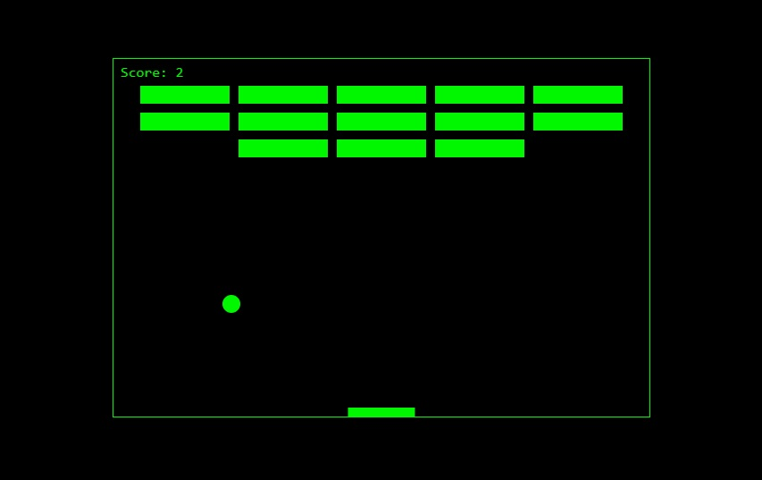

# breakout-canvas
Juego estilo "Breakout" usando Canvas CSS y Javascript.
Basado en el tutorial de <a target="_blank" href="https://developer.mozilla.org/es/docs/Games/Workflows/Famoso_juego_2D_usando_JavaScript_puro">MDN web docs moz://a</a>

